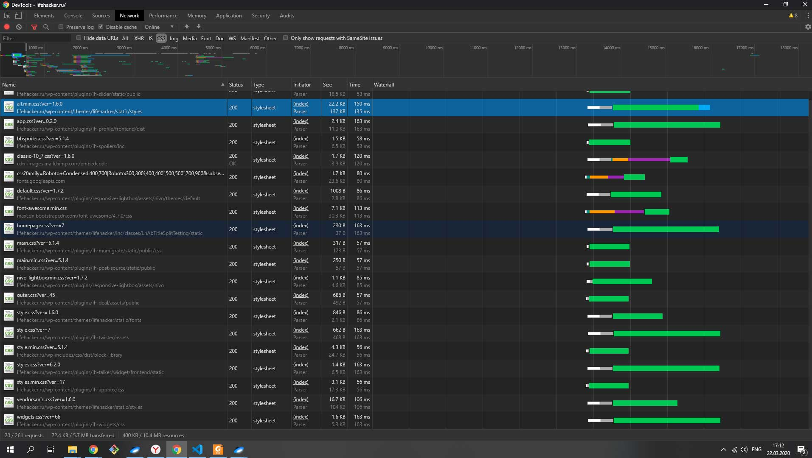
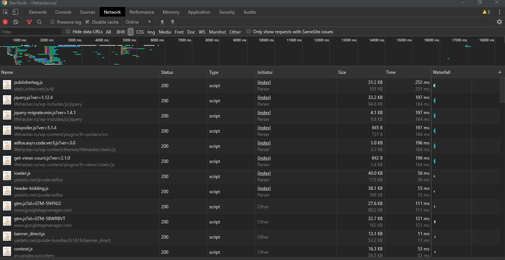
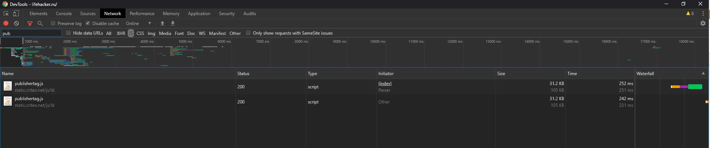
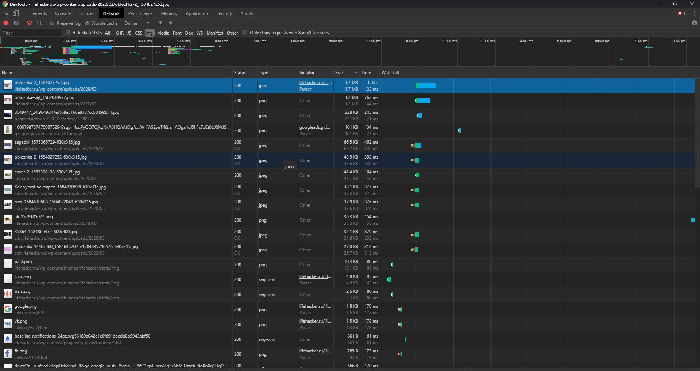

# Использование браузерных DevTools - анализ сайта

## Вкладка Network

[Профиль загрузки ресурсов при открытии страницы в HAR архиве](https://github.com/mgkOV/devtools-site-inspection/blob/master/lifehacker.ru.har)

- Очень много сетевых запросов. Очень много js и css файлов.
  В результате чего времени запросы находятся в очереди на загрузку (Queuing), т.к. браузер (HTTP 1) для одного домена позволяет только 6 TCP соединений.

- Есть ресурс, который загружается два раза `static.criteo.net/js/ld/publishertag.js`

- Огромного размера изображения, которые на странице имеют небольшие размеры в пикселях, а на их загрузку уходит много времени (600 - 900 мс)

